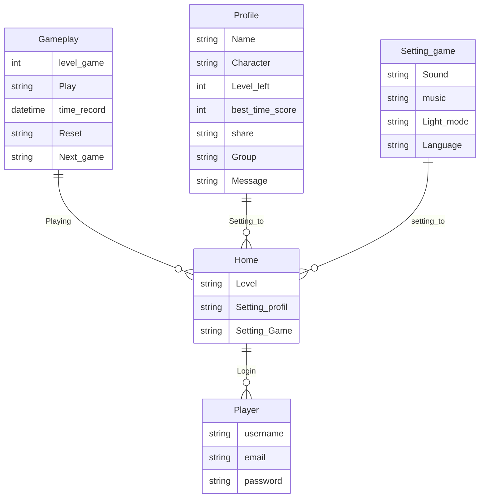
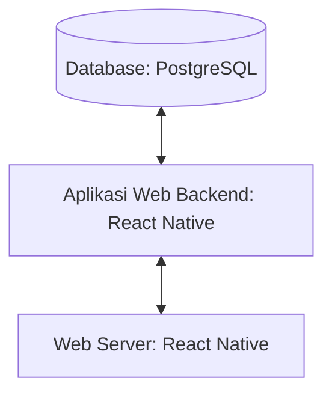

## 1.1	Latar Belakang
Di era digitalisasi seperti sekarang, kebutuhan manusia sudah tidak bisa lagi terpuaskan oleh sesuatu yang sederhana atau tradisional. Khususnya dunia hiburan, yang selalu bergerak selaras dengan perkembangan teknologi, permainan tradisional kini mulai beralih menjadi permainan modern yang berwujud game digital. Melihat hal ini, tentunya kita juga harus menyesuaikan diri dengan keadaan yang ada. Namun, sebagian besar game digital saat ini banyak memberikan dampak negatif tanpa memprioritaskan edukasi yang positif. Oleh karena itu, kita memerlukan game yang memberikan dampak positif terutama tentang edukasi agama untuk anak-anak melalui pendekatan asmaul husna. Oleh sebab itu, game memory asmaul husna(Memana) hadir sebagai jawaban dari berbagai problem permasalahan di atas.
## Deskripsi Teknologi Informasi
Aplikasi ini berguna sebagai media edukasi asma allah, yang mengenalkan para pengguna dengan asmaul husna melalui permainan menyenangkan yang berfokus pada metode mencocokkan, mengingat, ketepatan, insting, dan ketangkasan pengguna dalam menangkap informasi yang didapatkan. Tujuan dari aplikasi ini sendiri adalah untuk mengenalkan asmaul husna kepada berbagai kalangan di masyarakat agar lebih mudah dalam menghafal asmaul husna dengan lebih menyenangkan, terlepas dari stigma bahwa menghafal asmaul husna adalah sebuah kegiatan yang membosankan dan monoton. 
## Branding
Branding meliputi:
- Merk: Game Memana
- Tagline: Hadir untuk memberikan edukasi asma allah di era digitalisasi
- Campaign: Aplikasi yang berguna sebagai media pendekatan dan pengenalan asmaul husna melalui metode yang menyenangkan.

Target user:
- Usia 5+
- Seseorang yang ingin mengenal asmaul husna namun terhalang rasa bosan.
- Seseorang yang ingin meningkatkan diri dalam melatih kemampuan mengingat, ketepatan, insting, dan ketangkasan pengguna dalam menangkap informasi yang didapatkan.
- Seseorang mencari kegiatan yang bermanfaat namun menyenangkan.
  
User experience theme:
- Mudah
- Sederhana
- Menyenangkan
- Warna: Orange / white / black / gray / greend
  
Inspirasi desain:

## 2. User Story
Sebagai | Saya Ingin Bisa | Sehingga | Prioritas
---|---|---|---
Pengguna | Login ke dalam game | Dapat memulai permainan | ⭐⭐⭐
Pengguna | Memilih level | Dapat menyesuaikan game dengan tingkat kesulitan yang di inginkan | ⭐⭐⭐
Penggunac| Share to public | Dapat melakukan share ke public terkait best skor,dll.|⭐⭐⭐
Pengguna | Best Skor Public | Dapat melihat reting Best Skor Public |⭐⭐⭐
Pengguna | Invite | Dapat melakukan invite untuk melakukan permainan bersama |⭐⭐⭐⭐
Pengguna | Melakukan setting |Dapat menyesuaikan fitur yang di inginkan dalam game play|⭐⭐⭐⭐
Pengguna | Melakukan reset  | Dapat mengulangi kembali game ditingkat kesulitan yang sama | ⭐⭐⭐⭐
Pengguna | Lanjut ke level berikutnya | Dapat memperoleh tingkat kesulitan yang lebih tinggi | ⭐⭐⭐⭐
Pengguna | Setting Profil| Dapat mengubah name, char, dan melihat best skor |⭐⭐⭐⭐
Pengguna | Memencet pilihan kartu | Dapat mengetahui isi di balik kartu | ⭐⭐⭐⭐⭐
Pengguna | Melihat gambar di balik kartu | Dapat menyocokan antara dua gambar yang sama | ⭐⭐⭐⭐⭐
## 3. Struktur Data

Untuk lebih lengkapnya bisa di cek di  

## 4. Arsitektur Sistem

## 5. Teknologi, Library, dan Framework

- Framework Aplikasi:
   - React Native
- Database:
   - PostgreSQL
- UI/UX Design:
   - Figma
- Text Editor:
   - Visual Studio Code
- Web Languange:
   - HTML, CSS
- Programming Languange:
   - Javascript
- Library:
   -  Bootstrap

## 6. Desain User Experience dan User Interface

Untuk lebih lengkapnya bisa di cek di ?type=design&node-id=0-1&mode=design&t=EHifcDSZptQHqDKf-0) 
## 7. Demonstrasi Video

Link https://youtu.be/RmEc3OkZfuo?si=e6Gn1UmijsYOECVl

## 8. Bagaimana mesin komputasi dan sistem operasi berperan dalam produk teknologi informasimu ?
Link https://youtu.be/RmEc3OkZfuo?si=e6Gn1UmijsYOECVl

## 9. Bagaimana algoritma, struktur data, dan bahasa pemrograman berperan dalam produk teknologi informasimu ?
Link https://youtu.be/RmEc3OkZfuo?si=e6Gn1UmijsYOECVl

## 10. Bagaimana metode pengembangan perangkat lunak / Software Development Life Cycle berperan dalam produk teknologi informasimu ?
Link https://youtu.be/RmEc3OkZfuo?si=e6Gn1UmijsYOECVl
## 11. Bagaimana database / sistem basis data berperan dalam produk teknologi informasimu ?
Link https://youtu.be/RmEc3OkZfuo?si=e6Gn1UmijsYOECVl
