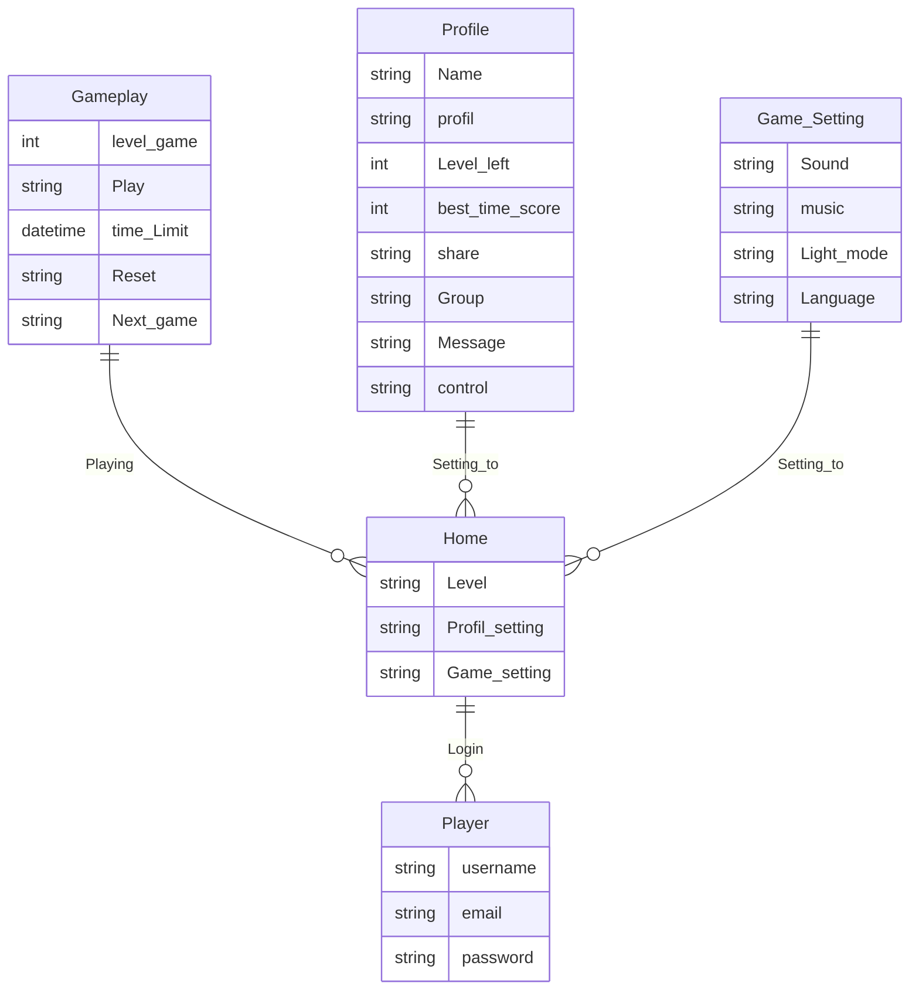
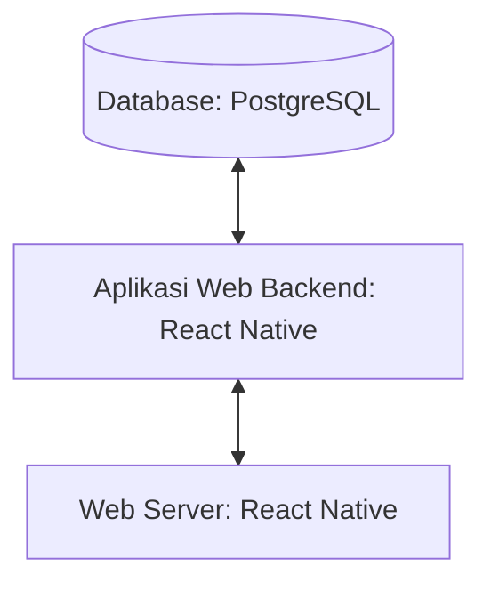

## 1.1	Latar Belakang
Di era digitalisasi seperti sekarang, kebutuhan manusia sudah tidak bisa lagi terpuaskan oleh sesuatu yang sederhana atau tradisional. Khususnya dunia hiburan, yang selalu bergerak selaras dengan perkembangan teknologi, permainan tradisional kini mulai beralih menjadi permainan modern yang berwujud game digital. Melihat hal ini, tentunya kita juga harus menyesuaikan diri dengan keadaan yang ada. Namun, sebagian besar game digital saat ini banyak memberikan dampak negatif tanpa memprioritaskan edukasi yang positif. Oleh karena itu, kita memerlukan game yang memberikan dampak positif terutama tentang edukasi agama untuk anak-anak melalui pendekatan asmaul husna. Oleh sebab itu, game memory asmaul husna(Memana) hadir sebagai jawaban dari berbagai problem permasalahan di atas.
## Deskripsi Teknologi Informasi
Aplikasi ini berguna sebagai media edukasi asma allah, yang mengenalkan para pengguna dengan asmaul husna melalui permainan menyenangkan yang berfokus pada metode mencocokkan, mengingat, ketepatan, insting, dan ketangkasan pengguna dalam menangkap informasi yang didapatkan. Tujuan dari aplikasi ini sendiri adalah untuk mengenalkan asmaul husna kepada berbagai kalangan di masyarakat agar lebih mudah dalam menghafal asmaul husna dengan lebih menyenangkan, terlepas dari stigma bahwa menghafal asmaul husna adalah sebuah kegiatan yang membosankan dan monoton. 
## Branding
Branding meliputi:
- Merk: Game Memana
- Tagline: Hadir untuk memberikan edukasi asma allah di era digitalisasi
- Campaign: Aplikasi yang berguna sebagai media pendekatan dan pengenalan asmaul husna melalui metode yang menyenangkan.

Target user:
- Usia 5+
- Seseorang yang ingin mengenal asmaul husna namun terhalang rasa bosan.
- Seseorang yang ingin meningkatkan diri dalam melatih kemampuan mengingat, ketepatan, insting, dan ketangkasan pengguna dalam menangkap informasi yang didapatkan.
- Seseorang mencari kegiatan yang bermanfaat namun menyenangkan.
  
User experience theme:
- Mudah
- Sederhana
- Menyenangkan
- Warna: ala suasana pagi / light blue / light yellow
  
Inspirasi desain:

## 2. User Story
Sebagai | Saya Ingin Bisa | Sehingga | Prioritas
---|---|---|---
Pengguna | Login ke dalam game | Dapat memulai permainan | ⭐⭐⭐
Pengguna | Memilih level | Dapat menyesuaikan game dengan tingkat kesulitan yang di inginkan | ⭐⭐⭐
Penggunac| Share to public | Dapat melakukan share ke public terkait best skor,dll.|⭐⭐⭐
Pengguna | Melakukan setting |Dapat menyesuaikan fitur yang di inginkan dalam game play|⭐⭐⭐⭐
Pengguna | Melakukan reset  | Dapat mengulangi kembali game ditingkat kesulitan yang sama | ⭐⭐⭐⭐
Pengguna | Lanjut ke level berikutnya | Dapat memperoleh tingkat kesulitan yang lebih tinggi | ⭐⭐⭐⭐
Pengguna | Setting Profil| Dapat mengubah name, char, dan melihat best skor |⭐⭐⭐⭐
Pengguna | Memencet pilihan kartu | Dapat mengetahui isi di balik kartu | ⭐⭐⭐⭐⭐
Pengguna | Melihat gambar di balik kartu | Dapat menyocokan antara dua gambar yang sama | ⭐⭐⭐⭐⭐
## 3. Struktur Data

Untuk lebih lengkapnya bisa di cek di  

## 4. Arsitektur Sistem

## 5. Teknologi, Library, dan Framework

- Framework Aplikasi:
   - React Native
- Database:
   - PostgreSQL
- UI/UX Design:
   - Figma
- Text Editor:
   - Visual Studio Code
- Web Languange:
   - HTML, CSS
- Programming Languange:
   - Javascript

## 6. Desain User Experience dan User Interface

Untuk lebih lengkapnya bisa di cek di ?type=design&node-id=41%3A138&mode=design&t=Y5og76kWE9BvhZ1h-1) 
## 7. Demonstrasi Video

Link youtube nya

## 8. Bagaimana mesin komputasi dan sistem operasi berperan dalam produk teknologi informasimu ?
Mesin komputasi

Mesin komputasi adalah perangkat keras yang menjalankan software, termasuk game. Memory game adalah software yang berjalan di atas mesin komputasi. Mesin komputasi menyediakan komponen-komponen berikut yang diperlukan untuk menjalankan memory game:

    Unit pemrosesan pusat (CPU) adalah komponen utama dari mesin komputasi yang bertanggung jawab untuk mengeksekusi kode game. Dalam memory game, CPU bertanggung jawab untuk membaca dan mengeksekusi kode yang menampilkan kartu, melacak kartu yang telah dipilih, dan menghitung skor.
    Memori utama adalah komponen mesin komputasi yang menyimpan data game, seperti kartu dan skor. Dalam memory game, memori utama menyimpan gambar kartu, posisi kartu, dan skor pemain.
    Unit pengolah grafis (GPU) adalah komponen mesin komputasi yang bertanggung jawab untuk menampilkan grafik game. Dalam memory game, GPU bertanggung jawab untuk menampilkan gambar kartu di layar.

Sistem operasi

Sistem operasi adalah software yang mengelola sumber daya mesin komputasi, seperti memori dan CPU. Sistem operasi menyediakan layanan yang diperlukan untuk menjalankan software, termasuk game. Dalam memory game, sistem operasi menyediakan layanan berikut:

    Manajemen memori adalah layanan yang mengalokasikan dan mengelola memori utama. Dalam memory game, sistem operasi mengalokasikan memori untuk kode game, data game, dan grafik game.
    Manajemen file adalah layanan yang membaca dan menulis file game. Dalam memory game, sistem operasi membaca file game untuk memuat kode game dan data game, dan menulis file game untuk menyimpan skor pemain.
    Antarmuka pengguna adalah layanan yang memungkinkan pengguna berinteraksi dengan game. Dalam memory game, sistem operasi menyediakan antarmuka pengguna yang memungkinkan pemain untuk memilih kartu dan melihat skor.

Contoh spesifik

Berikut adalah contoh spesifik bagaimana mesin komputasi dan sistem operasi digunakan dalam memory game:

    Saat pemain membuka game, sistem operasi memuat kode game ke memori utama.

Ketika pemain membuka game, sistem operasi membaca file game dan memuat kode game ke memori utama. Kode game kemudian dijalankan oleh CPU.

    Saat pemain memilih kartu, CPU mengeksekusi kode yang memindahkan kartu ke layar.

Ketika pemain memilih kartu, CPU mengeksekusi kode yang memindahkan kartu ke layar. Kode ini meminta GPU untuk menampilkan gambar kartu di posisi yang dipilih pemain.

    Saat pemain menutup game, sistem operasi menghapus kode game dari memori utama.

Ketika pemain menutup game, sistem operasi menghapus kode game dari memori utama. Ini mencegah game berjalan di latar belakang dan menggunakan sumber daya mesin komputasi.

Peningkatan

Mesin komputasi dan sistem operasi dapat digunakan untuk meningkatkan memory game dengan cara berikut:

    Mesin komputasi yang lebih cepat dapat membuat game berjalan lebih lancar.

Mesin komputasi yang lebih cepat dapat mengeksekusi kode game lebih cepat. Ini dapat membuat game berjalan lebih lancar dan responsif.

    Sistem operasi dengan manajemen memori yang lebih efisien dapat menggunakan memori utama secara lebih efektif.

Sistem operasi dengan manajemen memori yang lebih efisien dapat mengalokasikan memori utama secara lebih efisien. Ini dapat mencegah game menggunakan terlalu banyak memori dan menyebabkan lag.

    Sistem operasi dengan antarmuka pengguna yang lebih intuitif dapat membuatnya lebih mudah bagi pemain untuk mempelajari dan memainkan game.

Sistem operasi dengan antarmuka pengguna yang lebih intuitif dapat membuat game lebih mudah digunakan. Ini dapat membuat game lebih menarik bagi pemain dan meningkatkan kepuasan pengguna.

Dengan terus berkembangnya teknologi, mesin komputasi dan sistem operasi akan terus memainkan peran yang lebih penting dalam memory game.

Link youtube nya di detik jawaban in

## 9. Bagaimana algoritma, struktur data, dan bahasa pemrograman berperan dalam produk teknologi informasimu ?
Algoritma, struktur data, dan bahasa pemrograman berperan penting dalam memory game. Algoritma menentukan bagaimana game dijalankan, struktur data menyimpan data game, dan bahasa pemrograman digunakan untuk mengimplementasikan algoritma dan struktur data.

Algoritma

Algoritma adalah serangkaian langkah yang diikuti untuk menyelesaikan suatu tugas. Dalam memory game, algoritma bertanggung jawab untuk tugas-tugas berikut:

    Memuat kode game
    Menampilkan kartu
    Menerima input dari pemain
    Melacak kartu yang telah dipilih
    Menghitung skor

Algoritma yang digunakan dalam memory game dapat bervariasi tergantung pada desain game. Namun, secara umum, algoritma akan mengikuti langkah-langkah berikut:

    Memuat kode game

Algoritma pertama akan memuat kode game ke memori utama. Kode game ini akan berisi kode untuk menampilkan kartu, menerima input dari pemain, dan melacak kartu yang telah dipilih.

    Menampilkan kartu

Algoritma selanjutnya akan menampilkan kartu di layar. Algoritma ini akan menggunakan struktur data untuk menyimpan gambar kartu dan posisinya.

    Menerima input dari pemain

Algoritma selanjutnya akan menerima input dari pemain. Input ini dapat berupa pemilihan kartu atau gerakan mouse.

    Melacak kartu yang telah dipilih

Algoritma selanjutnya akan melacak kartu yang telah dipilih. Algoritma ini akan menggunakan struktur data untuk menyimpan kartu yang telah dipilih.

    Menghitung skor

Algoritma terakhir akan menghitung skor pemain. Skor pemain akan ditentukan berdasarkan jumlah kartu yang berhasil dicocokkan.

Struktur data

Struktur data adalah cara untuk menyimpan dan mengatur data. Dalam memory game, struktur data digunakan untuk menyimpan data berikut:

    Gambar kartu
    Posisi kartu
    Kartu yang telah dipilih

Struktur data yang umum digunakan dalam memory game adalah array, hash table, dan linked list.

    Array adalah struktur data yang menyimpan data dalam urutan tertentu. Array dapat digunakan untuk menyimpan gambar kartu.
    Hash table adalah struktur data yang menyimpan data berdasarkan kunci. Hash table dapat digunakan untuk menyimpan posisi kartu.
    Linked list adalah struktur data yang menyimpan data dalam bentuk linked list. Linked list dapat digunakan untuk menyimpan kartu yang telah dipilih.

Bahasa pemrograman

Bahasa pemrograman adalah alat yang digunakan untuk mengimplementasikan algoritma dan struktur data. Dalam memory game, bahasa pemrograman yang umum digunakan adalah C++, Java, dan Python.

C++ adalah bahasa pemrograman yang cepat dan efisien. Java adalah bahasa pemrograman yang portable dan mudah digunakan. Python adalah bahasa pemrograman yang mudah dipelajari dan digunakan.

Peningkatan

Algoritma, struktur data, dan bahasa pemrograman dapat digunakan untuk meningkatkan memory game dengan cara berikut:

    Algoritma yang lebih efisien dapat membuat game berjalan lebih lancar.
    Struktur data yang lebih efisien dapat menggunakan memori utama secara lebih efektif.
    Bahasa pemrograman yang lebih efisien dapat membuat game berjalan lebih cepat dan responsif.

Dengan terus berkembangnya teknologi, algoritma, struktur data, dan bahasa pemrograman akan terus memainkan peran yang lebih penting dalam memory game.

Link youtube nya di detik jawaban ini

## 10. Bagaimana metode pengembangan perangkat lunak / Software Development Life Cycle berperan dalam produk teknologi informasimu ?
Metode pengembangan perangkat lunak/Software Development Life Cycle (SDLC) berperan penting dalam pengembangan memory game. SDLC adalah proses sistematis untuk mengembangkan perangkat lunak. SDLC terdiri dari beberapa fase, termasuk:

    Analisis
    Gambar Fase Analisis SDLCTerbuka di jendela baru
    www.dicoding.com
    Fase Analisis SDLC
    Desain
    Gambar Fase Desain SDLCTerbuka di jendela baru
    www.binaracademy.com
    Fase Desain SDLC
    Implementasi
    Gambar Fase Implementasi SDLCTerbuka di jendela baru
    shavirapv.wordpress.com
    Fase Implementasi SDLC
    Pengujian
    Gambar Fase Pengujian SDLCTerbuka di jendela baru
    web.aikom.ac.id
    Fase Pengujian SDLC
    Pemeliharaan
    Gambar Fase Pemeliharaan SDLCTerbuka di jendela baru
    lp2m.uma.ac.id
    Fase Pemeliharaan SDLC

Setiap fase SDLC memiliki peran penting dalam pengembangan memory game.

Fase Analisis

Fase analisis adalah fase di mana kebutuhan pengguna diidentifikasi dan didefinisikan. Dalam fase ini, pengembang game akan bekerja dengan pengguna untuk memahami apa yang mereka inginkan dari game.

Fase Desain

Fase desain adalah fase di mana solusi perangkat lunak dirancang. Dalam fase ini, pengembang game akan menentukan algoritma, struktur data, dan bahasa pemrograman yang akan digunakan untuk membangun game.

Fase Implementasi

Fase implementasi adalah fase di mana kode game ditulis dan diuji. Dalam fase ini, pengembang game akan mengimplementasikan algoritma, struktur data, dan bahasa pemrograman yang dirancang di fase desain.

Fase Pengujian

Fase pengujian adalah fase di mana game diuji untuk memastikan bahwa berfungsi dengan benar. Dalam fase ini, pengembang game akan menggunakan berbagai metode pengujian untuk memastikan bahwa game tidak memiliki bug atau kesalahan.

Fase Pemeliharaan

Fase pemeliharaan adalah fase di mana game diperbarui dan ditingkatkan. Dalam fase ini, pengembang game akan memperbaiki bug, menambahkan fitur baru, atau meningkatkan kinerja game.

SDLC dapat digunakan untuk mengembangkan memory game dengan cara yang efisien dan efektif. SDLC membantu memastikan bahwa game memenuhi kebutuhan pengguna dan berfungsi dengan benar.

Berikut adalah beberapa contoh spesifik bagaimana SDLC dapat digunakan untuk mengembangkan memory game:

    Pada fase analisis, pengembang game dapat menggunakan survei atau wawancara untuk mengumpulkan data tentang kebutuhan pengguna.
    Pada fase desain, pengembang game dapat menggunakan diagram UML untuk menggambarkan arsitektur game.
    Pada fase implementasi, pengembang game dapat menggunakan alat pengembangan perangkat lunak untuk menulis kode game.
    Pada fase pengujian, pengembang game dapat menggunakan alat pengujian otomatis untuk menguji game.
    Pada fase pemeliharaan, pengembang game dapat menggunakan sistem manajemen versi untuk melacak perubahan pada game.

Dengan menggunakan SDLC, pengembang game dapat mengembangkan memory game yang berkualitas tinggi yang memenuhi kebutuhan pengguna.
Link youtube nya di detik jawaban ini

 

## 11. Bagaimana database / sistem basis data berperan dalam produk teknologi informasimu ?
Database atau sistem basis data berperan penting dalam memory game. Database dapat digunakan untuk menyimpan data game, seperti gambar kartu, posisi kartu, dan skor pemain.

Data game

Database dapat digunakan untuk menyimpan data game, seperti:

    Gambar kartu

Database dapat digunakan untuk menyimpan gambar kartu, seperti kartu wajah, kartu angka, atau kartu simbol. Gambar kartu dapat disimpan dalam format bitmap, JPEG, atau PNG.

    Posisi kartu

Database dapat digunakan untuk menyimpan posisi kartu di layar. Posisi kartu dapat disimpan dalam format koordinat XY.

    Skor pemain

Database dapat digunakan untuk menyimpan skor pemain. Skor pemain dapat disimpan dalam format integer atau float.

Fitur game

Database juga dapat digunakan untuk mendukung fitur game, seperti:

    Level

Database dapat digunakan untuk menyimpan level game. Level game dapat disimpan dalam format integer atau string.

    Mode permainan

Database dapat digunakan untuk menyimpan mode permainan game. Mode permainan game dapat disimpan dalam format integer atau string.

    Pengaturan

Database dapat digunakan untuk menyimpan pengaturan game, seperti volume suara, efek suara, dan bahasa. Pengaturan game dapat disimpan dalam format integer, string, atau boolean.

Peningkatan

Database dapat digunakan untuk meningkatkan memory game dengan cara berikut:

    Database yang lebih efisien dapat membuat game berjalan lebih lancar.
    Database yang lebih terstruktur dapat memudahkan pengembang game untuk menambahkan fitur baru.
    Database yang lebih aman dapat melindungi data game dari akses yang tidak sah.

Dengan menggunakan database, pengembang game dapat mengembangkan memory game yang lebih kompleks dan menarik.

Berikut adalah beberapa contoh spesifik bagaimana database dapat digunakan dalam memory game:

    Database dapat digunakan untuk menyimpan gambar kartu dalam format yang terkompresi. Ini dapat membuat game berjalan lebih lancar.
    Database dapat digunakan untuk menyimpan level game dalam format yang terstruktur. Ini dapat memudahkan pengembang game untuk menambahkan level baru.
    Database dapat digunakan untuk menyimpan pengaturan game dalam format yang aman. Ini dapat melindungi data game dari akses yang tidak sah.

Link youtube nya di detik jawaban ini
