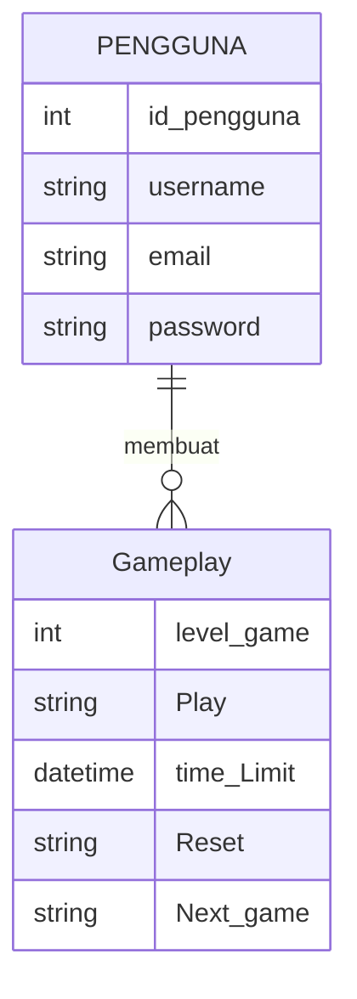
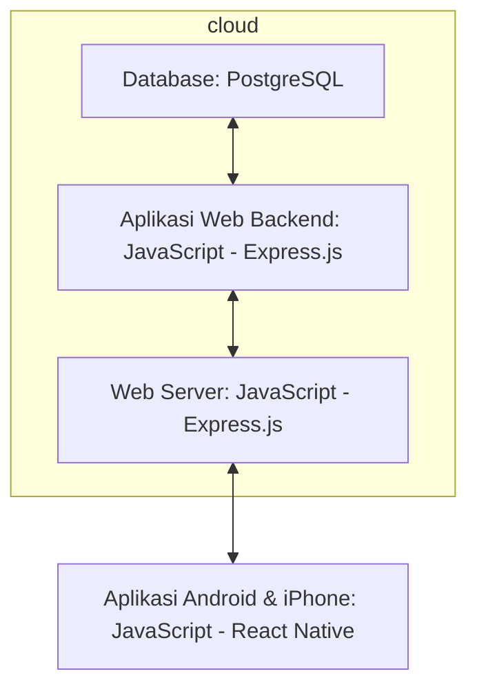

## 1.1	Latar Belakang
Di era digitalisasi seperti sekarang, kebutuhan manusia sudah tidak bisa lagi terpuaskan oleh sesuatu yang sederhana atau tradisional. Khususnya dunia hiburan, yang selalu bergerak selaras dengan perkembangan teknologi, permainan tradisional kini mulai beralih menjadi permainan modern yang berwujud game digital. Melihat hal ini, tentunya kita juga harus menyesuaikan diri dengan keadaan yang ada. Namun, sebagian besar game digital saat ini banyak memberikan dampak negatif tanpa memprioritaskan edukasi yang positif. Oleh karena itu, kita memerlukan game yang memberikan dampak positif terutama tentang edukasi agama untuk anak-anak melalui pendekatan asmaul husna. Oleh sebab itu, game memory asmaul husna hadir sebagai jawaban dari berbagai problem permasalahan di atas
## Deskripsi Teknologi Informasi
Aplikasi ini berguna sebagai media edukasi asma allah, yang mengenalkan para pengguna dengan asmaul husna melalui permainan menyenangkan yang berfokus pada metode mencocokkan, mengingat, ketepatan, insting, dan ketangkasan pengguna dalam menangkap informasi yang didapatkan. Tujuan dari aplikasi ini sendiri adalah untuk mengenalkan asmaul husna kepada berbagai kalangan di masyarakat agar lebih mudah dalam menghafal asmaul husna dengan lebih menyenangkan, terlepas dari stigma bahwa menghafal asmaul husna adalah sebuah kegiatan yang membosankan dan monoton. 
## Branding
Branding meliputi:
- Merk: Game Memana
- Tagline: Hadir untuk memberikan edukasi asma allah di era digitalisasi
- Campaign: Aplikasi yang berguna sebagai media pendekatan dan pengenalan asmaul husna melalui metode yang menyenangkan.

Target user:
- Seluruh kalangan dalam masyarakat.
- Seseorang yang ingin mengenal asmaul husna namun terhalang rasa bosan.
- Seseorang yang ingin meningkatkan diri dalam melatih kemampuan mengingat, ketepatan, insting, dan ketangkasan pengguna dalam menangkap informasi yang didapatkan.
- Seseorang mencari kegiatan yang bermanfaat namun menyenangkan.
  
User experience theme:
- Mudah
- Sederhana
- Menyenangkan
- Warna: ala suasana pagi / light blue / light yellow
  
Inspirasi desain:

## 2. User Story
Sebagai | Saya Ingin Bisa | Sehingga | Prioritas
---|---|---|---
Pengguna | Transcribe percakapan | dapat memahami apa yang orang ucapkan | ⭐⭐⭐⭐⭐
Pengguna | Text to speech | Membacakan apa yang saya ketik | ⭐⭐⭐⭐⭐
Pengguna | Mencari lokasi disekitar dengan fasilitas ramah disabilitas | Mendapat informasi mengenai fasilitas ramah disabilitas | ⭐⭐⭐⭐
Pengguna | Memberikan  mengenai lokasi dengan fasilitas ramah disabilitas | Dapat memberikan tanggapan | ⭐⭐⭐
Pengguna | Membalas Komentar | Dapat memberikan tanggapan | ⭐⭐⭐

## 3. Struktur Data

Cara membuat aneka macam bentuk grafik menggunakan mermaid.js bisa lihat di (https://mermaid.js.org/syntax/entityRelationshipDiagram.html) 

## 4. Arsitektur Sistem

## 5. Teknologi, Library, dan Framework

 - Bahasa Pemrograman:

   - HTML, CSS, dan javascript

- Platform Mobile:

   - VSC

- Framework Aplikasi:

   - React Native

- Database:

   - PostgreSQL

- UI/UX Design:

   - Figma

## 6. Desain User Experience dan User Interface

Bisa load image 

## 7. Demonstrasi Video

Link youtube nya

## 8. Bagaimana mesin komputasi dan sistem operasi berperan dalam produk teknologi informasimu ?

Link youtube nya di detik jawaban ini

## 9. Bagaimana algoritma, struktur data, dan bahasa pemrograman berperan dalam produk teknologi informasimu ?

Link youtube nya di detik jawaban ini

## 10. Bagaimana metode pengembangan perangkat lunak / Software Development Life Cycle berperan dalam produk teknologi informasimu ?

Link youtube nya di detik jawaban ini

 

## 11. Bagaimana database / sistem basis data berperan dalam produk teknologi informasimu ?

Link youtube nya di detik jawaban ini
